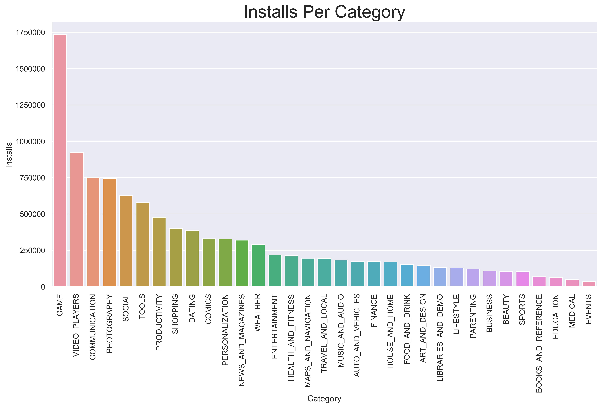
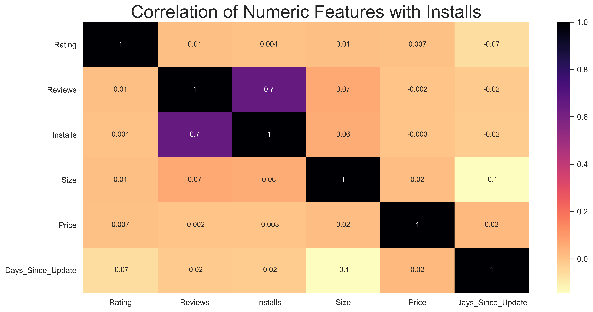
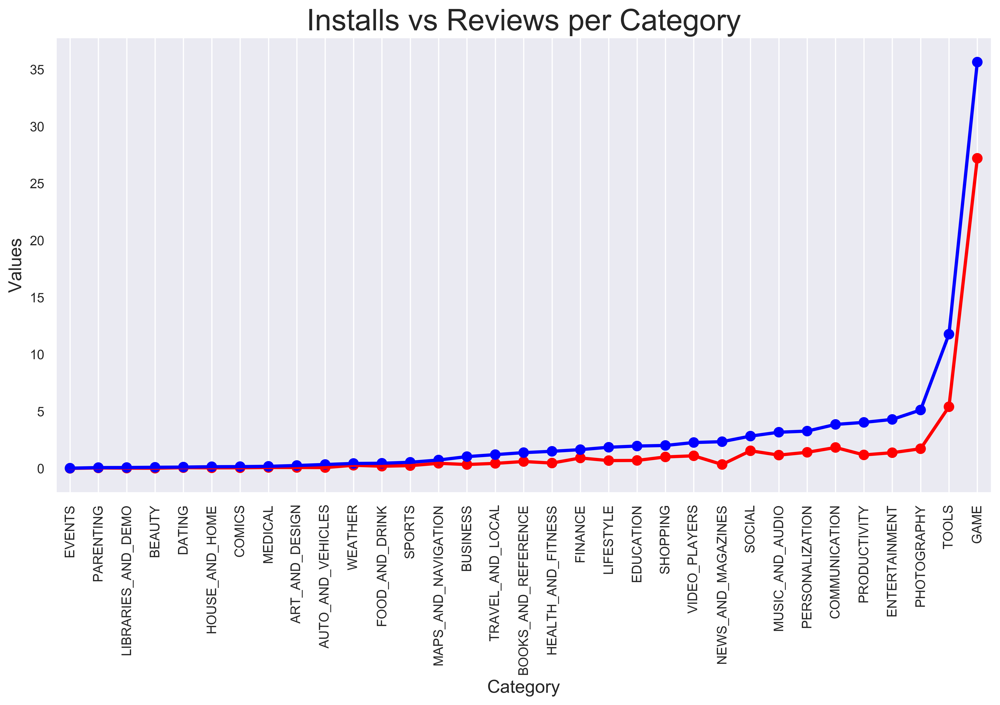

 

# Does the Level of Application Installs Affect Its Ratings

Zachary Villarreal

## Table of Contents
* [Background](#Background)
    * [Project Description](#Project-Description)
    * [Motivation](#Motivation)
* [Data](#Data)
    * [Pipeline](#Pipeline)
    * [Attributes](#Attributes)
* [Analysis](#Analysis)
    * [Exploratory Data Analysis](#Exploratory-Data-Analysis-(EDA))
    * [How Do the Level of Installs Differ](#How-do-the-Number-of-Installs-Differ)
    * [What Other Factors Are Affected by Installs](#What-Other-Factors-Are-Affected-by-Installs)
    * [Other Factors of Success](#Other-Factors-of-Success)
* [Hypothesis Testing](#Hypothesis-Testing)
    * [Preparation](#Preparation)
    * [Welch's T-Test](#Welch's-T-Test)
    * [Further Analysis](#Further-Analysis)
* [Conclusion](#Conclusion)

## Background

### Project Description
---
Google Play, formerly known as the Android Market, is the official app store for the Android Operating System, owned and operated by Google. As of 2017, Google Play is home to over 3.5 million applications in 145 countries. Applications are available to install through this market, either at a charge or for free. 

<a href="#Does-the-Number-of-Application-Installs-Affect-Its-Rating">Back to top</a>

### Motivation
---
While I was a student in high school, I found my self often wondering if I, along with my friends, could create an app that would be successful. I often pondered about what goes into a "successful" app. Was it the number of installs? Was it the rating it received? Or was it the contents of the app? There seems to be a limitation of app development, in that there are many factors that go into making an app "successful." 

In fact, Many technology-forward companies today are driven by the app market and often dedicate teams to providing insight into how to make their applications successful and what type of behavior does success have on other aspects of their application. In this EDA project, I am attempting to quantify the relationship between two app factors that can often be measured in terms of success, rating and number of installs. 

<a href="#Does-the-Number-of-Application-Installs-Affect-Its-Rating">Back to top</a>

## Data

### Pipeline
---
Data allocation: 
* Google Play Store Data: [Google Play Store Apps](https://www.kaggle.com/gauthamp10/google-playstore-apps#Google-Playstore-Full.csv)

Data processing: 
* The data was downloaded as a CSV (comma-separated values file).
* Pandas was used to import the data and aggregate and group it into one data frame.
* Exploratory Data Analysis and statistical testing were completed once the data was cleaned.
    * The code to clean the data can be found [here](src/Data_Cleaning.ipynb).
* Hypothesis Testing was completed after initial EDA.
* Visualization was completed using Matplotlib and Seaborn.
* Statistical calculations were completed using SciPy

<a href="#Does-the-Number-of-Application-Installs-Affect-Its-Rating">Back to top</a>

### Attributes
---
**Google Play Store Dataset:**

| Feature Name      | Description                           | Unique Value Count |
|-------------------|:-------------------------------------:|-------------------:|
|       App         | Name of the App                       | 230480             |
|     Category      | App Category                          | 33                 |
|      Rating       | Application's Rating on the Playstore | 91512              |
|     Reviews       | Number of Reviews of the App          | 21646              |
|     Installs      | Number of Installs of the App         | 20                 |
|       Size        | App File Size                         | 1233               |
| Price             | Price of the App                      | 455                |
| Cost              | Free (0) vs Paid (1)                  | 2                  |
| Content Rating    | Audience Suitability of App           | 6                  |
| Last Updated      | Date the App was Last Updated         | 2741               |
| Latest Version    | Current Version of the App            | 111                |
| Days Since Update | Difference (Days) Since Last Update   | 2741               |

* The data frame contains 251,941 rows and 12 features, explained in the table above.

<a href="#Does-the-Number-of-Application-Installs-Affect-Its-Rating">Back to top</a>

## Analysis

### Exploratory Data Analysis (EDA)
---
Exploratory Data Analysis for the Google Play Store data set was centered around `Installs`, for the reason that I am measuring *success* in terms of this feature.

Over the course of this EDA, we will look at how `Installs` acts over the other features.

<a href="#Does-the-Number-of-Application-Installs-Affect-Its-Rating">Back to top</a>

### How Do the Number of Installs Differ?
---

 

We can see that the `Education` and `Game` categories rule the Google Play market in terms of number of applications, but we are more interested which category has the highest number of average installs. So let's compare the number of installs to the different categories.

 

From this we can tell that the **actual** category that contains the highest number of installs is the `Game Category`. That's pretty interesting. But, what about content rating? Surely this *must* have an impact!

 

It is quite apparent that `For Everyone` holds a monopoly on the total installs compared to the other groups. A combination of an app that is a `Game` and is rated `For Everyone` to see the most amount of installs. Seeing the 

<a href="#Does-the-Number-of-Application-Installs-Affect-Its-Rating">Back to top</a>

### What Other Factors Are Affected by Installs?
---
Up to this point, I have only looked at the distributions of installs over categorical and non-ordinal data. However, I wanted to look to see how the number of installs affects *numerical factors*. Initially, I am assumed that the number of reviews and number of installs would be correlated, and this appeared to be the case. 

 

Wow! It seems that, in fact, out of all the numeric features, `Reviews` is the most positively correlated with `Installs` and has a correlation coefficient of 0.65, interesting! Let's explore this topic further...

 

This is interesting. We can see that in the Installs vs Reviews plot, both of the lines, installs and reviews, increase in an almost identical fashion. However, before using Reviews for my hypothesis testing, I want to test whether or not they are independent. So I ran a chi-squared contingency test for independence.

**Null Hypothesis: Installs and Reviews are *dependent*.** 
**Alternate Hypothesis: Installs and Reviews are *independent*.** 

`pvalue, dof, cont = scipy.stats.chi2_contingency(reviews_vs_installs)` 
`pvalue = 0.9991`

Thus, we can say that we **failed to disprove** the null hypothesis, and that Installs and Reviews are in fact, *dependent*. It's no secret that the number of reviews and number of installs are codependent. Meaning, that as the app receives more installs the number of reviews increases as well. Unfortunately, I could not further test my initial notion that the number of reviews could be used to predict number of installs, or success.

Thus, I chose not to pursue the `Reviews` angle further. Let's explore another avenue that might predict success... 

<a href="#Does-the-Number-of-Application-Installs-Affect-Its-Rating">Back to top</a>

### Other Factors of Success
---
An application with a high rating, i.e. rating from `4.0 to 5.0`, could also be considered successful if it has a high number of installs. Although I previously looked at the distribution of applications and their number of installs, I thought it would be interesting to look at the distribution of applications and their ratings. My initial assumption is that, with the higher number of installs, the distribution of ratings would be lower. 

 

The distribution of Ratings over the application count is centered around 4.5, with an outlier at 5.0. One of the problems I ran into while cleaning my data was that there were a large number of applications that had a rating of 5.0, while their number of reviews was small, `n < 100`. This outlier proved to be a problem that needed to be solved, how are the higher rated applications throwing off the distribution of ratings over *all* applications. I wanted to take a look at the number of installs per application rating to see if this solved my problem.

 

By my previous claim, the outlier from the previous graph seemed to disappear. This was because the total number of installs for applications with a rating of 5.0, `n = 9,756,878`, was significantly less than the number of installs for applications in which this distribution is centered around, 4.4-4.5, `n = 16,005,839,635`. This is going against my initial assumption that install size will affect overall rating. 

This is worthy of further investigation, time to run a hypothesis test!

<a href="#Does-the-Number-of-Application-Installs-Affect-Its-Rating">Back to top</a>

## Hypothesis Testing

### Preparation
----
In order for my to run a hypothesis test on the impact the level of installs an application has on its distribution of ratings, I needed to split up the data into the specific levels of installs that showed the highest count of the number of applications. I did this by list iteration into the pandas data frame, as shown below. 
`downloads_100 = play_store_data[play_store_data['Installs'] == 10000]`

My null hypothesis is that there is no difference in the distribution of ratings between a higher level of installs and a lower level of installs. Thus, my alternative hypothesis states the opposite, in that there *is* a difference in distribution of ratings per level of installs. (See mathematical representation of these hypotheses below).

$$ H_0: \ Rating_{HighInstalls} \mu  =  Rating_{LowInstalls}\mu $$
$$ H_a: \ Rating_{HighInstalls} \mu  \neq  Rating_{LowInstalls}\mu $$

### Welch's T-Test
---
To calculate the p values for my hypothesis, and because the distribution of ratings was normally distributed,  I used the [Welch's T-Test](#https://en.wikipedia.org/wiki/Welch's_t-test) to test the difference in population means.

In order to select which levels of installs to compare the mean of their respective rating, I need to pick the levels that contain the closest sample size. For example, this is the pair I would choose to run Welch's t-test with 

| Install Level | Sample Size |
| ------------- | ----------- |
| 50,000        | 21,414      |
|100,000        | 34,665      |

 

| Install Level | Sample Size |
| ------------- | ----------- |
| 10,000        | 57,630      |
|50,000         | 21,414      |

 

| Install Level | Sample Size |
| ------------- | ----------- |
| 10,000        | 57,630      |
|100,000         | 34,665     |

 

As we can see in the 3 cases above, we fail to reject the null hypothesis since our p-values are greater than our pre-set $\alpha $ = 0.05. This is interesting, because I initially believed that the level of installs for which an application lies would have some affect on the rating's distribution. However, I only specifically tested around the installs where we found the majority of applications to exist, 10,000. Let's see how the distribution behaves below the majority. 

| Install Level | Sample Size |
| ------------- | ----------- |
| 1,000         |  47,233     |
|10,000         | 57,630      |

 

Wow! It seems that the distribution of ratings has changed drastically between the 10,000 level and the 1,000 level of installs. The distribution is no longer normal and thus can no longer be calculated with Welch's t-test, but what is truly occurring in the plot above. Let's explore this further.

<a href="#Does-the-Number-of-Application-Installs-Affect-Its-Rating">Back to top</a>

### Further Analysis

As discussed in the section above, the behavior of rating distribution is changed once the level of installs is below 10,000. But why is that? To begin this next stage of analysis, I need to look into the factors that I believe to be affecting it. 

I am hypothesizing that the reason the distribution of reviews is skewed towards a rating of 5.0, is based on both the lack of installs and reviews, as well as, a mixture of external influence. Let's explore this first part visually.

 

From the graph above, it appears that the percentage of applications with a 5.0 rating and a level of installs of 1000 surpasses that of the 10,000 level of installs. Interesting, but I want to look at an even more extreme sample before I continue testing. 

 

Wow! There now exists a 30% difference in the number of 5.0 rated applications in the 100 install level compared to that of the 10,000 level! This finding, as we can see above, then coincides with my initial belief that applications with the lower installs have a higher percentage of 5.0 ratings. Can we explore this further?

I believe we can! I next want to look at the distribution of the different level of installs based on the assumption that the application has a rating of 5.0. 

 

In this plot, we can see that the percentage of 5.0 rated applications is skewed far to the left. Meaning, that the lower the amount of installs the higher the percentage of 5.0 ratings, because, as we saw in the EDA portion of this project, [view here](#What-Other-Factors-Are-Affected-by-Installs?), the total number of installs is codependent with the total number of reviews. Thus, the lower the install level, the lower the number of reviews, the less the distribution of ratings will represent the application store's behavior as a whole.

<a href="#Does-the-Number-of-Application-Installs-Affect-Its-Rating">Back to top</a>

## Conclusion

