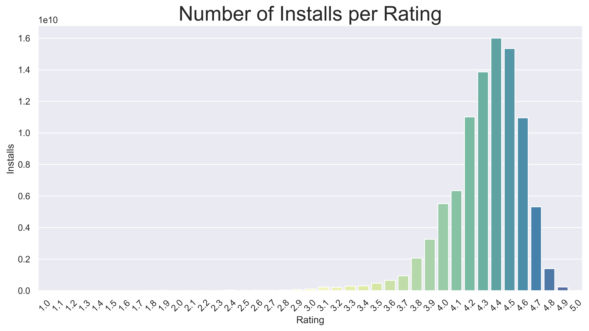
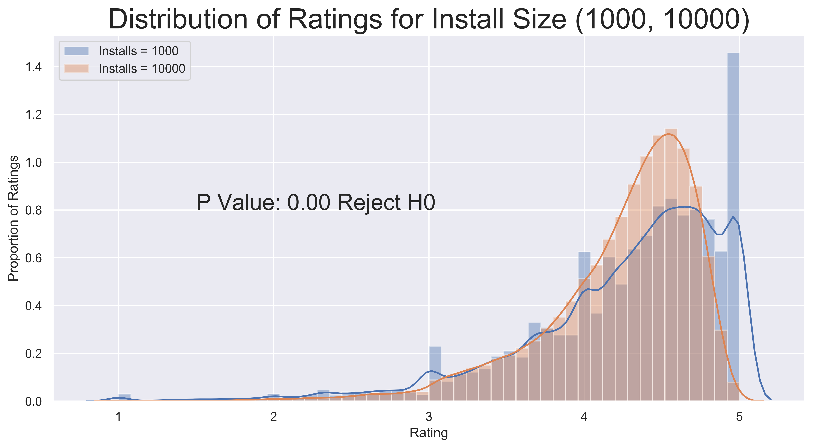

 

# What Makes an Application Successful

Zachary Villarreal

## Table of Contents
* [Background](#Background)
    * [Project Description](#Project-Description)
    * [Motivation](#Motivation)
* [Data](#Data)
    * [Pipeline](#Pipeline)
    * [Attributes](#Attributes)
* [Analysis](#Analysis)
    * [Exploratory Data Analysis](#Exploratory-Data-Analysis-(EDA))
    * [How Do the Level of Installs Differ](#How-do-the-Number-of-Installs-Differ)
    * [What Other Factors Are Affected by Installs](#What-Other-Factors-Are-Affected-by-Installs)
    * [Other Factors of Success](#Other-Factors-of-Success)
* [Hypothesis Testing](#Hypothesis-Testing)
    * [Preparation](#Preparation)
    * [Welch's T-Test](#Welch's-T-Test)
    * [Further Analysis](#Further-Analysis)
* [Conclusion](#Conclusion)
    * [Next Steps](#Next-Steps)

## Background

### Project Description
---
Google Play, formerly known as the Android Market, is the official app store for the Android Operating System, owned and operated by Google. As of 2017, Google Play is home to over 3.5 million applications in 145 countries. Applications are available to install through this market, either at a charge or for free. 

<a href="#Table-of-Contents">Back to top</a>

### Motivation
---
While I was a student in high school, I found my self often wondering if I, along with my friends, could create an app that would be successful. I often pondered about what goes into a "successful" app. Is it the number of installs the application gets? Is it the rating it receives? Or is it the contents of the app? Asking myself these questions, presents a problem in app development, in that there are many factors that go into making an app "successful", thus trying to predict the application market is difficult. 

In fact, many technology-forward companies today are driven by this market and often dedicate teams to providing insight into how to make their applications successful and what type of behavior these successful applications exhibit. In this project, I am attempting to quantify the relationship between multiple application factors that can often be measured in terms of success, rating, reviews, and number of installs. 

<<a href="#Table-of-Contents">Back to top</a>

## Data

### Pipeline
---
Data allocation: 
* Google Play Store Data: [Google Play Store Apps](https://www.kaggle.com/gauthamp10/google-playstore-apps#Google-Playstore-Full.csv)

Data processing: 
* The data was downloaded as a CSV (comma-separated values file).
* Pandas was used to import the data and aggregate and group it into one data frame.
* Exploratory Data Analysis and statistical testing were completed once the data was cleaned.
    * The code to clean the data can be found [here](src/Data_Cleaning.ipynb).
    * The code depicting EDA can be found [here](src/Google_Play_Store_EDA.ipynb)
* Hypothesis Testing was completed after initial EDA.
    * The code to conduct the hypothesis testing can be found [here](src/Hypothesis_Testing.ipynb)
* Visualization was completed using Matplotlib and Seaborn.
* Statistical calculations were completed using SciPy

<a href="#Table-of-Contents">Back to top</a>

### Attributes
---
**Google Play Store Dataset:**

| Feature Name      | Description                           | Unique Value Count |
|-------------------|:-------------------------------------:|-------------------:|
|       App         | Name of the App                       | 230480             |
|     Category      | App Category                          | 33                 |
|      Rating       | Application's Rating on the Playstore | 91512              |
|     Reviews       | Number of Reviews of the App          | 21646              |
|     Installs      | Number of Installs of the App         | 20                 |
|       Size        | App File Size                         | 1233               |
| Price             | Price of the App                      | 455                |
| Cost              | Free (0) vs Paid (1)                  | 2                  |
| Content Rating    | Audience Suitability of App           | 6                  |
| Last Updated      | Date the App was Last Updated         | 2741               |
| Latest Version    | Current Version of the App            | 111                |
| Days Since Update | Difference (Days) Since Last Update   | 2741               |

* The data frame contains 251,941 rows and 12 features, explained in the table above.

<a href="#Table-of-Contents">Back to top</a>

## Analysis

### Exploratory Data Analysis (EDA)
---
Exploratory Data Analysis for the Google Play Store data set was centered around `Installs`, `Reviews`, and `Ratings`, for the reason that I am measuring the application's success in terms of these features.

Over the course of this EDA, we will look at how their respective behaviors.

<a href="#Table-of-Contents">Back to top</a>

### How Do the Number of Installs Differ?
---

 

Interesting, we can see that the `Education` and `Game` categories rule the Google Play market in terms application prevalence. However, because we are looking at how to be most successful in this ever-changing market, we are more interested which category has the highest level of average installs. So let's compare the number of installs to each of the categories categories.

 

From this we can tell that the category that actually contains the highest number of installs, by far, is the `Game Category`. As future developers we can use this information to motivate our future project, that's pretty interesting. Due to the somewhat extreme variation in levels of installs based on the category, I'm interested in looking into content rating's impact on this feature, as well. Surely this *must* have an impact!

 

It is quite apparent that `For Everyone` holds a monopoly on the total installs compared to the other groups. A combination of an application that is a `Game` and is rated `For Everyone`, is apparent that, if we want to create a better proportional chance at receiving installs, we should look into developing an application that fits these two criteria.

<a href="#Table-of-Contents">Back to top</a>

### What Other Factors Are Affected by Installs?
---
Up to this point, we have only looked at the distributions of installs over categorical and non-ordinal data. However, I wanted to look to see how the number of installs affects numerical factors. Initially, I assumed that the number of reviews and number of installs would be correlated, as well as the distribution of reviews. Let's look at a heat map that will test for correlation between these elements of success. 

 

In the graph above, it is quite apparent that, out of all the numeric features, `Reviews` is the most positively correlated with `Installs` and has a correlation coefficient of 0.65, interesting! However, `Ratings` seemed to have almost no correlation to the level of `Installs`. Let's explore the relationship between `Reviews` and `Installs` topic further.

 

This is interesting. We can see that in the Installs vs Reviews plot, both of the lines, installs and reviews, increase in an almost identical fashion. However, I want to run a small hypothesis test on their relationship, I want to test whether or not they are independent. So I ran a chi-squared contingency test for independence.

**Null Hypothesis: Installs and Reviews are *dependent*.** 
**Alternate Hypothesis: Installs and Reviews are *independent*.** 

`pvalue, dof, cont = scipy.stats.chi2_contingency(reviews_vs_installs)` 
`pvalue = 0.9991`

Thus, we can say that we **failed to disprove** the null hypothesis, and that Installs and Reviews are in fact, *dependent*. It is no secret that the number of reviews and number of installs are codependent. Meaning, that as the application receives more installs the number of reviews increases as well. 

Therefore, we could say that, if we want to have a successful application, besides creating an application that is rated For Everyone and is under the GAME category, is to make sure our application is being reviewed by more people, which could in turn increase our capture in the market. 

<a href="#Table-of-Contents">Back to top</a>

### Other Factors of Success
---
An application with a high rating, i.e., rating from `4.0 to 5.0`, could also be considered successful if, moreover, it has a high number of installs. Although I previously looked at the distribution of applications and their number of installs, I thought it would be interesting to look at the distribution of applications and their ratings. My initial assumption is that, with a higher number of installs, the average score would be lower.

 

From the graph above, we can see that the distribution of Ratings over the application count is centered around 4.5, with an high count at 5.0. One of the problems I ran into while cleaning my data was that there were a large number of applications that had a rating of 5.0, while their number of reviews was small, `n < 1000`. This proved to be a problem that needed to be solved; how are the higher rated applications throwing off the distribution of ratings over *all* applications. I wanted to take a look at the level of installs per application rating to see if this proved my skepticism.

 

By my previous claim, the high application count at 5.0 from the previous graph seemed to disappear, we will revisit this topic in the section below. This was because the total number of installs for applications with a rating of 5.0, `n = 9,756,878`, was significantly less than the number of installs for applications in which this distribution is centered around, 4.4-4.5, `n = 16,005,839,635`. 

This is worthy of further investigation, time to test if my hypothesis is correct!

<a href="#Table-of-Contents">Back to top</a>

##  First Hypothesis Testing

### Preparation
----
In order for my to run a hypothesis test on the impact the level of installs an application has on its distribution of ratings, I needed to split up the data into the specific levels of installs that showed the highest count of the number of applications. I did this using list iteration to query into the pandas data frame, as shown below. 
`downloads_100 = play_store_data[play_store_data['Installs'] == 10000]`

My null hypothesis states that there is no difference in the mean ratings between a higher level of installs and a lower level of installs. Thus, my alternative hypothesis states the opposite, in that there *is* a difference in mean ratings per level of installs. (See mathematical representation of these hypotheses below).

$$ H_0: \ Rating_{HighInstalls} \mu  =  Rating_{LowInstalls}\mu $$
$$ H_a: \ Rating_{HighInstalls} \mu  \neq  Rating_{LowInstalls}\mu $$

### Welch's T-Test
---
To calculate the p values for my hypothesis, and because the distribution of ratings was normally distributed,  I used the [Welch's T-Test](#https://en.wikipedia.org/wiki/Welch's_t-test) to test the difference in population means.

In order to select which levels of installs to compare the mean of their respective rating, I need to pick the levels that contain the closest sample size. These were the pairs I chose to run Welch's t-test with 

| Install Level | Sample Size |
| ------------- | ----------- |
| 50,000        | 21,414      |
|100,000        | 34,665      |

 

| Install Level | Sample Size |
| ------------- | ----------- |
| 10,000        | 57,630      |
|50,000         | 21,414      |

 

| Install Level | Sample Size |
| ------------- | ----------- |
| 10,000        | 57,630      |
|100,000         | 34,665     |

 

As we can see in the 3 cases above, we fail to reject the null hypothesis since our p-values are greater than our pre-set $\alpha $ = 0.05. This is interesting, because I initially believed that the level of installs, for which an application lies, would have some affect on the rating's distribution. However, I only specifically tested those levels where we found the majority of applications to exist, 10,000. Let's see how the distribution behaves below the majority. 

| Install Level | Sample Size |
| ------------- | ----------- |
| 1,000         |  47,233     |
|10,000         | 57,630      |

 

Wow! It seems that the ratings distribution has changed drastically between the 10,000 level and the 1,000 level of installs. The distribution is no longer normal and thus can no longer be calculated with Welch's t-test. I know am curious as to what is truly occurring in the plot above. Let's explore this further.

<a href="#Table-of-Contents">Back to top</a>

### Further Analysis

As discussed in the section above, the behavior of rating distribution is changed once the level of installs is below 10,000. But why is that? To begin this next stage of analysis, I need to look into the factors that I believe to be affecting it. 

I am hypothesizing that the reason the distribution of reviews is skewed towards a rating of 5.0, is based on both the lack of installs and reviews, as well as, a mixture of external influence. Let's explore this first part visually.

 

From the graph above, it appears that the percentage of applications with a 5.0 rating and a level of installs of 1000 surpasses that of the 10,000 level of installs. Interesting, but I want to look at an even more extreme sample before I continue testing. 

 

Wow! There now exists a 30% difference in the number of 5.0 rated applications in the 100 install level compared to that of the 10,000 level! This finding, as we can see above, then coincides with my initial belief that applications with the lower installs have a higher percentage of 5.0 ratings. Can we explore this further?

I believe we can! I next want to look at the distribution of the different level of installs based on the assumption that the application has a rating of 5.0. 

 

In this plot, we can see that the percentage of 5.0 rated applications is skewed far to the left. Meaning, that the lower the amount of installs the higher the percentage of 5.0 ratings, because, as we saw in the EDA portion of this project, [view here](#What-Other-Factors-Are-Affected-by-Installs?), the total number of installs is codependent with the total number of reviews. Thus, the lower the install level, the lower the number of reviews, the less the distribution of ratings will represent the application store's behavior as a whole.

Unfortunately, due to the nature of the non-normality of the distributions of ratings over the differing levels of installs, we can no longer pursue this hypothesis testing. So, what other factor might have an affect on ratings can we test?

<a href="#Table-of-Contents">Back to top</a>

## Second Hypothesis Testing

### Preparation
----
For my second hypothesis testing, since we are studying the success factors of applications in the Google Store, I am interested on the impact the categorization has on the application's mean rating. In order to conduct this hypothesis test, I need to split up the data into the specific categories of the applications. I want to specifically look at the top 6 categories that exhibited the largest average installs, as seen in the plot [here](#How-Do-the-Number-of-Installs-Differ?). I did this by using list iteration to query into the pandas data frame, as shown below.  

`game_rating = play_store_data[play_store_data['Category'] == 'GAME']`

My null hypothesis is that there is no difference in the mean rating between the categories tested. Thus, my alternative hypothesis states the opposite, in that there *is* a difference in mean rating per category of application. (See mathematical representation of these hypotheses below).

$$ H_0: \ GAME_{Rating} \mu  =  VIDEOPLAYERS_{Rating} \mu = COMMUNICATION_{Rating} \mu = PHOTOGRAPHY_{Rating} \mu = SOCIAL_{Rating} \mu = TOOLS_{Rating}\mu $$
$$ H_a: \ GAME_{Rating} \mu  \neq  VIDEOPLAYERS_{Rating} \mu \neq COMMUNICATION_{Rating} \mu \neq PHOTOGRAPHY_{Rating} \mu \neq SOCIAL_{Rating} \mu \neq TOOLS_{Rating}\mu $$

To calculate the p-value for my hypothesis testing, I used the [Kruskal-Wallis H Test](#https://en.wikipedia.org/wiki/Kruskal%E2%80%93Wallis_one-way_analysis_of_variance), or one-way ANOVA on ranks. This test specifically for nonparametric data that analyzes whether samples originate from the sample distribution, which means it tests to see if there's a difference in means. As we saw in the hypothesis testing above, our data, which we thought was normally distributed, ended up being nonparametric. To combat this issue, I used H-Test. 

 

In the Kruskal-Wallis test above, it was calculated that the `p-value = 0.0104`, which you can find at the bottom of the [Hypothesis Testing Notebook](src/Hypothesis_Testing.ipynb). This means that I can successfully reject the *null* hypothesis, with a preset $\alpha$ value of **0.05**, signifying that there is a statistical difference between the ratings mean across the categories.

<a href="#Table-of-Contents">Back to top</a>

## Conclusion

As we've seen, throughout this analysis of some of the applications' features in the Google Play Store, it is becoming clearer that Google's application market is a highly complex entity that is determined by a plethora of factors, not just by three factors. But what can we state? 

We saw that the categories for which level of installs were the highest was the `GAME` category with a content rating for `EVERYONE`. The review count exhibited a moderate positive correlation with the level of installs. As we saw in our last two hypothesis tests, the application's ratings are volatile and are not consistent over either levels of installs or categories, as we proved by rejecting the null hypothesis in our second hypothesis test. 

There are many variables that go into making an application successful, I hope that I was able to shed some light on just some of the differing aspects that this market has to offer.
