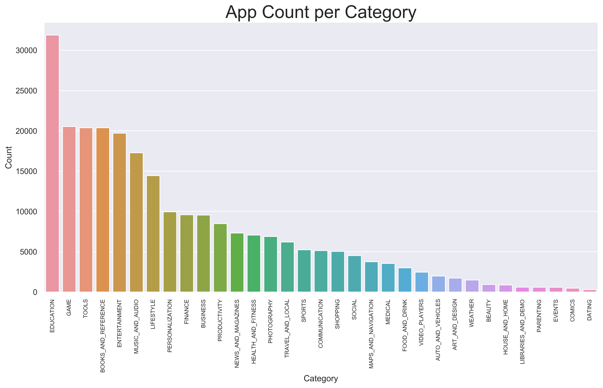

 

# Does the Number of Application Installs Affect Its Ratings

Zachary Villarreal

## Table of Contents
* [Background](#Background)
    * [Project Description](#Project-Description)
    * [Motivation](#Motivation)
* [Data](#Data)
    * [Pipeline](#Pipeline)
    * [Attributes](#Attributes)
* [Analysis](#Analysis)
    * [Exploratory Data Analysis](#Exploratory-Data-Analysis-(EDA))
    * [How Do the Number of Installs Differ](#How-do-the-Number-of-Installs-Differ)
    * [What Other Factors Are Affected by Installs](#What-Other-Factors-Are-Affected-by-Installs)
    * [Other Factors of Success](#Other-Factors-of-Success)
* [Hypothesis Testing](#Hypothesis-Testing)
    * [Preparation](#Preparation)
* [Conclusion](#Conclusion)

## Background

### Project Description
---
Google Play, formerly known as the Android Market, is the official app store for the Android Operating System, owned and operated by Google. As of 2017, Google Play is home to over 3.5 million applications in 145 countries. Applications are available to install through this market, either at a charge or for free. 

<a href="#Does-the-Number-of-Application-Installs-Affect-Its-Rating">Back to top</a>

### Motivation
---
While I was a student in high school, I found my self often wondering if I, along with my friends, could create an app that would be successful. I often pondered about what goes into a "successful" app. Was it the number of installs? Was it the rating it received? Or was it the contents of the app? There seems to be a limitation of app development, in that there are many factors that go into making an app "successful." 

In fact, Many technology-forward companies today are driven by the app market and often dedicate teams to providing insight into how to make their applications successful and what type of behavior does success have on other aspects of their application. In this EDA project, I am attempting to quantify the relationship between two app factors that can often be measured in terms of success, rating and number of installs. 

<a href="#Does-the-Number-of-Application-Installs-Affect-Its-Rating">Back to top</a>

## Data

### Pipeline
---
Data allocation: 
* Google Play Store Data: [Google Play Store Apps](https://www.kaggle.com/gauthamp10/google-playstore-apps#Google-Playstore-Full.csv)

Data processing: 
* The data was downloaded as a CSV (comma-separated values file).
* Pandas was used to import the data and aggregate and group it into one data frame.
* Exploratory Data Analysis and statistical testing were completed once the data was cleaned.
    * The code to clean the data can be found [here](src/Data_Cleaning.ipynb).
* Hypothesis Testing was completed after initial EDA.
* Visualization was completed using Matplotlib and Seaborn.
* Statistical calculations were completed using SciPy

<a href="#Does-the-Number-of-Application-Installs-Affect-Its-Rating">Back to top</a>

### Attributes
---
**Google Play Store Dataset:**

| Feature Name      | Description                           | Unique Value Count |
|-------------------|:-------------------------------------:|-------------------:|
|       App         | Name of the App                       | 230480             |
|     Category      | App Category                          | 33                 |
|      Rating       | Application's Rating on the Playstore | 91512              |
|     Reviews       | Number of Reviews of the App          | 21646              |
|     Installs      | Number of Installs of the App         | 20                 |
|       Size        | App File Size                         | 1233               |
| Price             | Price of the App                      | 455                |
| Cost              | Free (0) vs Paid (1)                  | 2                  |
| Content Rating    | Audience Suitability of App           | 6                  |
| Last Updated      | Date the App was Last Updated         | 2741               |
| Latest Version    | Current Version of the App            | 111                |
| Days Since Update | Difference (Days) Since Last Update   | 2741               |

* The data frame contains 251,941 rows and 12 features, explained in the table above.

<a href="#Does-the-Number-of-Application-Installs-Affect-Its-Rating">Back to top</a>

## Analysis

### Exploratory Data Analysis (EDA)
---
Exploratory Data Analysis for the Google Play Store data set was centered around `Installs`, for the reason that I am measuring *success* in terms of this feature.

Over the course of this EDA, we will look at how `Installs` acts over the other features.

<a href="#Does-the-Number-of-Application-Installs-Affect-Its-Rating">Back to top</a>

### How Do the Number of Installs Differ?
---

 

We can see that the `Education` and `Game` categories rule the Google Play market in terms of number of applications, but we are more interested which category has the highest number of average installs. So let's compare the number of installs to the different categories.

 

From this we can tell that the **actual** category that contains the highest number of installs is the `Game Category`. That's pretty interesting. But, what about content rating? Surely this *must* have an impact!

 

It is quite apparent that `For Everyone` holds a monopoly on the total installs compared to the other groups. A combination of an app that is a `Game` and is rated `For Everyone` to see the most amount of installs. Seeing the 

<a href="#Does-the-Number-of-Application-Installs-Affect-Its-Rating">Back to top</a>

### What Other Factors Are Affected by Installs?
---
Up to this point, I have only looked at the distributions of installs over categorical and non-ordinal data. However, I wanted to look to see how the number of installs affects *numerical factors*. Initially, I am assumed that the number of reviews and number of installs would be correlated, and this appeared to be the case. 

 

Wow! It seems that, in fact, out of all the numeric features, `Reviews` is the most positively correlated with `Installs` and has a correlation coefficient of 0.65, interesting! Let's explore this topic further...

 

This is interesting. We can see that in the Installs vs Reviews plot, both of the lines, installs and reviews, increase in an almost identical fashion. However, before using Reviews for my hypothesis testing, I want to test whether or not they are independent. So I ran a chi-squared contingency test for independence.

**Null Hypothesis: Installs and Reviews are *dependent*.** 
**Alternate Hypothesis: Installs and Reviews are *independent*.** 

`pvalue, dof, cont = scipy.stats.chi2_contingency(reviews_vs_installs)` 
`pvalue = 0.9991`

Thus, we can say that we **failed to disprove** the null hypothesis, and that Installs and Reviews are in fact, *dependent*. It's no secret that the number of reviews and number of installs are codependent. Meaning, that as the app receives more installs the number of reviews increases as well. Unfortunately, I could not further test my initial notion that the number of reviews could be used to predict number of installs, or success.

Thus, I chose not to pursue the `Reviews` angle further. Let's explore another avenue that might predict success... 

<a href="#Does-the-Number-of-Application-Installs-Affect-Its-Rating">Back to top</a>

### Other Factors of Success
---
An application with a high rating, i.e. rating from `4.0 to 5.0`, could also be considered successful if it has a high number of installs. Although I previously looked at the distribution of applications and their number of installs, I thought it would be interesting to look at the distribution of applications and their ratings. My initial assumption is that, with the higher number of installs, the distribution of ratings would be lower. 

 

The distribution of Ratings over the application count is centered around 4.5, with an outlier at 5.0. One of the problems I ran into while cleaning my data was that there were a large number of applications that had a rating of 5.0, while their number of reviews was small, `n < 100`. This outlier proved to be a problem that needed to be solved, how are the higher rated applications throwing off the distribution of ratings over *all* applications. I wanted to take a look at the number of installs per application rating to see if this solved my problem.

 

By my previous claim, the outlier from the previous graph seemed to disappear. This was because the total number of installs for applications with a rating of 5.0, `n = 9,756,878`, was significantly less than the number of installs for applications in which this distribution is centered around, 4.4-4.5, `n = 16,005,839,635`. This is going against my initial assumption that install size will affect overall rating. 

This is worthy of further investigation, time to run a hypothesis test!

<a href="#Does-the-Number-of-Application-Installs-Affect-Its-Rating">Back to top</a>

## Hypothesis Testing

### Preparation
----
$$ H_0: \ N_1(μ_1,σ_12)  \neq  N_2(μ_2,σ_22) $$
$$ H_a: \ N_1(μ_1,σ_12) = N_2(μ_2,σ_22) $$
